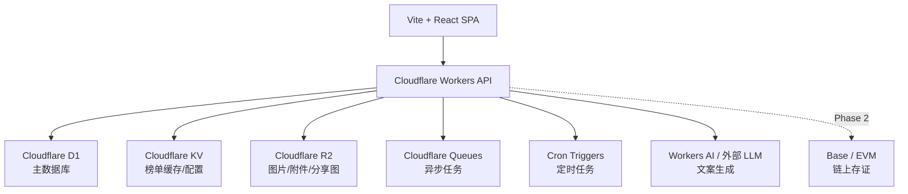

# KAIRO 项目开发文档 v3.2

> 项目名称：KAIRO  
> 中文精神内核：破茧重生  
> 产品定位：Crypto Comeback Launchpad  
> 技术路线：Vite + React + Cloudflare 全栈部署  
> 文档版本：v3.2  
> 生成日期：2026-06-26  
> 用途：AI 辅助开发主文档 / Codex 开发规格 / MVP 产品蓝图

---

## 0. 项目一句话定义

KAIRO 是一个通过 AI Builder、Catalyst 任务和社区 Boost，让沉睡代币破茧重生为新经济体的 Crypto Comeback Launchpad。

英文版：

> KAIRO is a Crypto Comeback Launchpad where AI builders, Catalyst missions, and community Boosts help sleeping tokens rise again as new economies.

---

## 1. 项目定位

KAIRO 面向三类用户：

1. 已发行代币但缺少真实使用场景的 Web3 项目方；
2. 使用 AI 快速构建产品的独立开发者 / AI Builder；
3. 愿意发现、助力和传播潜力项目的社区支持者。

项目方发布 **Catalyst**，也就是复兴催化任务；AI Builder 提交可上线 Demo 或产品方案；社区通过 **Boost**、分享和推荐帮助优质方案上榜。平台记录支持者贡献、开发者交付、奖励履约状态和项目破茧过程，最终形成一个“沉睡代币重生榜”和未来 **Genesis Candidate** 候选池。

KAIRO 第一阶段不做复杂链上金融，不做众筹，不做发币，不做自动空投，不做平台币。

第一阶段只做：

> **Catalyst 发布 + Builder 提交 + 社区 Boost + 公开榜单 + Funding Status + 人工种子内容 + 破茧故事传播。**

KAIRO 第一版不是金融平台，也不是纯投票网站，而是一个：

> **轻量但可信的 Crypto Comeback MVP。**

---

## 2. 核心叙事

### 2.1 品牌 Slogan

英文主 Slogan：

> **The moment sleeping tokens rise again.**

中文主 Slogan：

> **沉睡代币重生的临界时刻。**

强传播版：

> **Old tokens. New builders. Real products.**

中文：

> **旧代币，新开发者，真实产品。**

### 2.2 核心信仰

第一，代币不是死了，而是缺少新的临界时刻。

许多老代币仍然拥有社区、持币者、品牌记忆和共识，只是缺少真实产品、持续建设者和新的使用场景。KAIRO 要帮助这些沉睡代币找到新的产品场景。

第二，AI 让一个 Builder 也能推动一次重生。

过去一个代币需要完整团队才能搭建生态。现在一个 AI Builder 可以在 24–72 小时内做出 Demo、工具、小游戏、交易辅助、社区应用或链上交互产品。

第三，早期支持记录是一种新的社区资产。

用户今天 Boost 的项目和 Builder，会沉淀成 **Proof of Support**。未来项目方或开发者可以基于这些记录发放徽章、白名单、空投或其他可选奖励，但平台不承诺任何收益、回报或空投。

---

## 3. 品牌术语体系

| 旧概念 | KAIRO 术语 | 中文解释 | 内部代码建议 |
|---|---|---|---|
| Revive.fun | KAIRO | 主品牌 | app |
| Revival Bounty | Catalyst | 复兴催化任务 | bounty |
| Boost | Boost | 社区助力动作 | boost |
| 社区热度 | Momentum | 重生势能 | momentum |
| Revival Score | KAIRO Score | 开发者建设分 | builder_score |
| Support Points | Support Points | 支持者积分余额 | support_points |
| Proof of Support | Proof of Support | 支持证明事件记录 | support_events |
| Sleeping Giants | Dormant Giants | 沉睡巨人榜 | curated_items |
| Revival Winners | Breakout Stories | 破茧案例 | curated_items / completed_bounties |
| Hall of Fame | Comeback Hall | 重生名人堂 | curated_items |
| IBO Candidate | Genesis Candidate | 创世候选 | genesis_candidate |
| Escrow Status | Funding Status | 奖励履约状态 | funding_status |

说明：

- 对外产品语言使用 KAIRO 品牌词。
- 内部代码保持简单、清晰、稳定，例如 `bounties`、`boosts`、`builder_scores`。
- 品牌词对外展示，代码词服务开发，避免 AI 开发时因术语抽象产生误解。

---

## 4. 产品核心闭环

```mermaid
flowchart LR
    A["项目方发布 Catalyst"] --> B["平台审核 / 标记 Funding Status"]
    B --> C["AI Builder 提交 Demo / 方案"]
    C --> D["社区 Boost + 分享传播"]
    D --> E["项目方选择 Builder"]
    E --> F["Builder 交付 MVP"]
    F --> G["平台标记 Breakout / Completed"]
    G --> H["进入 Breakout Stories / Comeback Hall"]
    H --> I["Builder 获得 KAIRO Score"]
    I --> J["未来可成为 Genesis Candidate"]
```



第一版核心不是链上金融，而是让所有人看到：

- 哪个沉睡代币正在接近临界点；
- 谁在为它创造真实产品；
- 社区有多支持；
- 奖励是否可信；
- 最终有没有交付。

---

## 5. 三类用户

### 5.1 项目方 Project

项目方不需要理解 IBO、Escrow、Vault、TokenFactory。

他们只需要完成三步：

1. 输入代币名称、符号、合约地址、社区链接。
2. 填写希望 AI Builder 做什么，以及奖励说明。
3. 发布 Catalyst，并分享到 X / Telegram / 社区。

项目方核心按钮：

- Launch a Catalyst
- Submit Token
- Verify Reward
- Review Builders
- Choose Builder
- Approve Delivery

项目方看到的核心文案：

> Launch a Catalyst for your token.  
> Invite AI builders to create real products, activate your community, and turn dormant attention into a comeback story.

中文：

> 为你的代币发起一个 Catalyst。  
> 邀请 AI 开发者创造真实产品，重新激活社区，把沉睡的注意力变成一次破茧重生。

### 5.2 开发者 Builder

开发者不需要理解复杂 Web3。

他们只需要完成三步：

1. 浏览 Catalyst。
2. 提交 Demo、GitHub、视频或产品方案。
3. 拉社区 Boost、完成交付、获得 KAIRO Score。

开发者核心按钮：

- Find Catalysts
- Submit Demo
- Share My Submission
- View KAIRO Score
- Apply as Genesis Candidate

开发者看到的核心文案：

> Build the product that brings a token back.  
> Choose a Catalyst, submit your demo, earn community support, and grow your KAIRO Score.

中文：

> 做出那个让代币重新回来的产品。  
> 选择一个 Catalyst，提交 Demo，获得社区助力，积累你的 KAIRO Score。

### 5.3 支持者 Supporter

支持者第一版不付钱，只做社区助力和传播。

他们只需要完成三步：

1. 打开 Catalyst 或 Builder Submission 页面。
2. 点击 Boost。
3. 分享推荐链接，获得 Support Points，并留下 Proof of Support。

支持者核心按钮：

- Boost this Catalyst
- Boost this Builder
- Share to X
- Share to Telegram
- View Proof of Support

支持者看到的核心文案：

> Support the builders creating the next crypto comeback.  
> Every Boost adds momentum to the comeback.

中文：

> 支持正在创造下一个币圈重生故事的开发者。  
> 每一次 Boost，都在为这次重生积累势能。

---

## 6. MVP 功能范围

### 6.1 第一版必须做

| 模块 | 功能 |
|---|---|
| 用户系统 | 邮箱登录 / 社交登录预留 / 角色选择 |
| 项目方发布 | 创建 Catalyst |
| 代币资料 | Token Profile |
| Funding Status | 未验证 / 已承诺 / 已确认 / 已支付 / 审核中 |
| Builder 提交 | Demo、GitHub、视频、方案说明 |
| Boost | 支持 Catalyst 或支持 Builder Submission |
| Momentum | 根据 Boost、分享、提交等形成社区势能 |
| 推荐链接 | ref 参数追踪 |
| 榜单 | Hottest Catalysts / Top Builders / Dormant Giants |
| KAIRO Score | 开发者建设分，交付权重大于热度 |
| Support Points | 支持者积分余额 |
| Proof of Support | 不可变支持事件流水 |
| 分享文案 | X / Telegram / 复制链接 |
| 管理后台 | 审核、精选、奖励确认、交付标记、删除异常 Boost |
| 人工种子内容 | 手动添加榜单项目、沉睡巨人、精选案例 |

### 6.2 第一版暂不做

| 模块 | 暂缓原因 |
|---|---|
| 链上众筹 | 合规风险和代码量高 |
| 智能合约 Escrow | Phase 2 再做 |
| TokenFactory | 发币功能 Phase 4 再做 |
| 自动空投 | 等 Proof of Support 有真实数据后再做 |
| 平台币 | 先验证真实撮合和传播 |
| 去中心化仲裁 | 第一版平台人工处理 |
| 法币支付入口 | 可以先线下处理或人工确认 |
| ERC-4337 | 后续钱包抽象阶段再接 |
| Bonding Curve | Genesis 阶段再评估 |

---

## 7. 关键机制一：Funding Status 信任栓

### 7.1 为什么需要 Funding Status

如果第一版完全没有奖励确认机制，Builder 会担心：

> 我做完 Demo 或 MVP，项目方不给钱怎么办？

所以第一版虽然不写智能合约，但必须做一个轻量信任机制：

> **平台确认奖励承诺 + 公开 Funding Status + Funding Events 记录。**

注意：

> `escrowed` 可以作为内部状态字段，但前端不使用 “escrow / custody / 托管” 等表述。

### 7.2 Funding Status 状态机

每个 Catalyst 增加 `funding_status` 字段：

```txt
unverified      未验证，项目方只提交了意向
pledged         已承诺，平台审核通过但未完成确认
escrowed        内部状态：已收到等价凭证或完成奖励确认
partially_paid  已部分支付
paid            已完成支付
disputed        审核中
cancelled       已取消
```

前端展示文案：

| 内部状态 | 前端英文 | 前端中文 |
|---|---|---|
| unverified | Reward not verified | 奖励未验证 |
| pledged | Reward pledged | 奖励已承诺 |
| escrowed | Reward confirmed by KAIRO | 奖励已由 KAIRO 确认 |
| partially_paid | Partially paid | 已部分支付 |
| paid | Reward paid | 奖励已支付 |
| disputed | Under review | 审核中 |
| cancelled | Cancelled | 已取消 |

禁止在前端展示：

- Reward escrowed by KAIRO
- KAIRO custody
- 托管资金
- 平台托管
- 资金保管

### 7.3 Builder 筛选体验

Catalyst 列表页必须支持筛选：

- All Catalysts
- Confirmed Rewards
- High Reward
- Most Boosted
- Newest
- Closing Soon

默认排序建议：

> **奖励已确认 Catalyst > 奖励已承诺 Catalyst > 奖励未验证 Catalyst。**

### 7.4 Funding Events 记录方式

第一版不需要复杂支付系统，可以采用人工方式：

- 项目方线下提交奖励凭证；
- 项目方提供链上转账证明；
- 项目方提供稳定币转账记录；
- 管理员在后台标记 `funding_status`；
- 平台在项目完成后记录支付事件；
- 所有操作写入 `escrow_events` 表。

文档层面可继续使用 `escrow_events` 作为内部表名，但前端统一显示为：

> Funding Events / Reward Records

中文：

> 奖励记录 / 履约记录

---

## 8. 关键机制二：人工种子榜单

MVP 初期不能让首页空着。

### 8.1 为什么需要 Curated Items

冷启动初期真实 Catalyst、Builder 和 Breakout Stories 数量会很少。如果用户打开首页看到空榜单，会立即觉得平台没人。

所以第一版必须允许管理员人工添加种子内容，用于首页、榜单和专题页。

### 8.2 需要人工运营的榜单

| 榜单 | 是否允许人工添加 | 说明 |
|---|---:|---|
| Hottest Catalysts | 是 | 可手动 Featured |
| Dormant Giants | 是 | 平台主动列出值得重启的代币 |
| Top Builders | 是 | 可邀请种子 Builder |
| Breakout Stories | 是 | 可先放内测案例 / 模拟案例 / 标杆案例 |
| Comeback Hall | 是 | 可精选已完成案例 |
| Genesis Candidates | 是 | 可先放 Coming Soon / Candidate 状态 |

### 8.3 Dormant Giants 的作用

Dormant Giants 是非常重要的增长入口。

它不是普通榜单，而是项目方获客工具：

> 把“有社区、有历史、有潜在价值、但缺少新产品场景”的沉睡代币列出来，公开喊话：你的社区需要一个 KAIRO 时刻。

每个 Dormant Giant 页面可以有按钮：

- Claim this Token
- Launch a Catalyst
- Invite Community
- Suggest a Use Case

---

## 9. 关键机制三：KAIRO Score

Boost 能制造传播热度，但不能代表真实交付。

所以 KAIRO Score 必须让“完成交付”权重大于“获得投票”。

### 9.1 推荐公式

```txt
KAIRO Score =
提交项目数 × 10
+ 入围项目数 × 30
+ 获胜项目数 × 120
+ 完成交付数 × 400
+ 已确认奖励项目交付数 × 200
+ 获得有效 Boost 数 × 1
+ 推荐带来的有效 Boost 数 × 2
- 被隐藏/违规提交数 × 100
- 审核失败/争议失败次数 × 300
```

### 9.2 排序原则

Top Builders 排行榜不能只按 Boost 排。

建议排序权重：

```txt
Top Builder Rank =
KAIRO Score × 70%
+ 最近 30 天有效 Boost × 20%
+ 完成项目数量 × 10%
```

### 9.3 KAIRO Score 的用途

- Top Builders 排名；
- 更高质量 Catalyst 推荐；
- 未来 Genesis Candidate 准入；
- 平台精选；
- 未来徽章、白名单、空投或生态资格参考；
- 平台对 Builder 的可信履历展示。

---

## 10. 关键机制四：Boost、Momentum 与 Proof of Support

### 10.1 Boost

Boost 是用户最简单的支持动作。

按钮统一为：

- Boost this Catalyst
- Boost this Builder

不要再替换成 Spark、Fuel、Cheer。第一版要保持低门槛和高理解度。

### 10.2 Momentum

Momentum 是某个 Catalyst 或 Submission 的社区势能。

Momentum 可以由以下因素构成：

- 有效 Boost 数；
- 分享次数；
- 推荐带来的注册数；
- 推荐带来的有效 Boost 数；
- Submission 数；
- 最近 24 小时增长速度；
- 是否进入 Featured。

展示文案：

> Every Boost adds momentum to the comeback.

中文：

> 每一次 Boost，都在为这次重生积累势能。

### 10.3 Support Points

Support Points 是用户当前积分余额，用于运营激励和前端展示。

特点：

- 可累加；
- 可调整；
- 可过期；
- 可用于徽章；
- 不直接等于未来空投资格。

### 10.4 Proof of Support

Proof of Support 是支持事件流水，不是积分余额。

特点：

- 记录谁在什么时间支持了什么；
- 尽量只追加，不物理删除；
- 异常行为用 `validity_status` 标记；
- 未来可用于 Genesis 阶段的快照、徽章、白名单或可选奖励。

原则：

> Proof of Support 基于 `support_events` 和 `boosts` 生成，而不是基于 Support Points 余额生成。

---

## 11. 技术架构：Vite + React + Cloudflare 全栈

### 11.1 总体架构



### 11.2 技术选型

| 层 | 选择 |
|---|---|
| 前端 | Vite + React + TypeScript |
| 样式 | Tailwind CSS |
| 组件 | shadcn/ui |
| 路由 | React Router |
| 请求状态 | TanStack Query |
| 表单 | React Hook Form + Zod |
| 后端 API | Cloudflare Workers |
| API 框架 | Hono |
| 数据库 | Cloudflare D1 |
| 缓存 | Cloudflare KV |
| 文件存储 | Cloudflare R2 |
| 异步任务 | Cloudflare Queues |
| 定时任务 | Cron Triggers |
| 部署 | Cloudflare Workers / Pages |
| 本地开发 | Cloudflare Vite Plugin + Wrangler |
| 后续链 | Base |
| 后续钱包 | Privy / ERC-4337 |

### 11.3 Cloudflare 各组件用途

#### Workers

用于所有后端 API：

```txt
/api/auth/*
/api/bounties/*
/api/submissions/*
/api/boosts/*
/api/leaderboard/*
/api/admin/*
/api/share/*
```

#### D1

用于主业务数据库：

- users
- tokens
- bounties
- submissions
- boosts
- builder_scores
- support_points
- support_events
- referrals
- escrow_events
- curated_items
- admin_actions

#### KV

用于缓存和配置：

- 首页榜单缓存；
- 热门 Catalyst 缓存；
- Top Builders 缓存；
- Featured 配置；
- 简单站点配置；
- 分享文案缓存。

注意：

> D1 是事实源，KV 只是缓存。

#### R2

用于文件：

- Token Logo；
- Builder 截图；
- 分享海报；
- 用户头像；
- 项目图片；
- 奖励证明截图。

#### Queues

用于异步任务：

- 重新计算 KAIRO Score；
- 更新 Support Points；
- 生成分享海报；
- 处理推荐统计；
- 触发通知。

#### Cron Triggers

用于定时任务：

- 每 10 分钟更新排行榜；
- 每小时刷新 Featured 榜单；
- 每天重新计算 KAIRO Score；
- 每天生成运营数据快照。

---

## 12. 数据模型 v3.2

### 12.1 users

```sql
CREATE TABLE users (
  id TEXT PRIMARY KEY,
  email TEXT,
  display_name TEXT,
  avatar_url TEXT,
  role TEXT DEFAULT 'supporter',
  wallet_address TEXT,
  twitter_handle TEXT,
  telegram_handle TEXT,
  created_at TEXT NOT NULL,
  updated_at TEXT NOT NULL
);
```

### 12.2 tokens

```sql
CREATE TABLE tokens (
  id TEXT PRIMARY KEY,
  name TEXT NOT NULL,
  symbol TEXT NOT NULL,
  chain TEXT,
  contract_address TEXT,
  logo_url TEXT,
  website_url TEXT,
  twitter_url TEXT,
  telegram_url TEXT,
  status TEXT DEFAULT 'sleeping',
  created_at TEXT NOT NULL,
  updated_at TEXT NOT NULL
);
```

### 12.3 bounties

内部表名继续用 `bounties`，前端展示为 Catalyst。

```sql
CREATE TABLE bounties (
  id TEXT PRIMARY KEY,
  token_id TEXT NOT NULL,
  created_by TEXT NOT NULL,
  title TEXT NOT NULL,
  description TEXT NOT NULL,
  reward_text TEXT,
  reward_type TEXT DEFAULT 'offchain',
  funding_status TEXT DEFAULT 'unverified',
  contact_info TEXT,
  deadline TEXT,
  status TEXT DEFAULT 'pending_review',
  boost_count INTEGER DEFAULT 0,
  momentum_score INTEGER DEFAULT 0,
  submission_count INTEGER DEFAULT 0,
  featured INTEGER DEFAULT 0,
  created_at TEXT NOT NULL,
  updated_at TEXT NOT NULL
);
```

`status` 可选：

```txt
pending_review
open
reviewing
building
completed
failed
hidden
cancelled
```

`funding_status` 可选：

```txt
unverified
pledged
escrowed
partially_paid
paid
disputed
cancelled
```

### 12.4 submissions

```sql
CREATE TABLE submissions (
  id TEXT PRIMARY KEY,
  bounty_id TEXT NOT NULL,
  builder_id TEXT NOT NULL,
  name TEXT NOT NULL,
  tagline TEXT NOT NULL,
  demo_url TEXT,
  github_url TEXT,
  video_url TEXT,
  screenshot_url TEXT,
  description TEXT,
  status TEXT DEFAULT 'submitted',
  boost_count INTEGER DEFAULT 0,
  momentum_score INTEGER DEFAULT 0,
  delivery_status TEXT DEFAULT 'not_started',
  created_at TEXT NOT NULL,
  updated_at TEXT NOT NULL
);
```

`status` 可选：

```txt
submitted
shortlisted
winner
rejected
hidden
```

`delivery_status` 可选：

```txt
not_started
building
submitted_for_review
approved
rejected
completed
```

### 12.5 boosts

```sql
CREATE TABLE boosts (
  id TEXT PRIMARY KEY,
  user_id TEXT NOT NULL,
  bounty_id TEXT,
  submission_id TEXT,
  referrer_id TEXT,
  ip_hash TEXT,
  user_agent_hash TEXT,
  source TEXT DEFAULT 'direct',
  validity_status TEXT DEFAULT 'valid',
  created_at TEXT NOT NULL
);
```

`validity_status` 可选：

```txt
valid
suspicious
invalid
removed
```

### 12.6 support_points

Support Points 是积分余额表。

```sql
CREATE TABLE support_points (
  user_id TEXT PRIMARY KEY,
  total_points INTEGER DEFAULT 0,
  boost_points INTEGER DEFAULT 0,
  referral_points INTEGER DEFAULT 0,
  share_points INTEGER DEFAULT 0,
  valid_boost_count INTEGER DEFAULT 0,
  updated_at TEXT NOT NULL
);
```

### 12.7 support_events

Proof of Support 的核心事件流水表。

```sql
CREATE TABLE support_events (
  id TEXT PRIMARY KEY,
  user_id TEXT NOT NULL,
  event_type TEXT NOT NULL,
  target_type TEXT NOT NULL,
  target_id TEXT NOT NULL,
  bounty_id TEXT,
  submission_id TEXT,
  referrer_id TEXT,
  points_delta INTEGER DEFAULT 0,
  validity_status TEXT DEFAULT 'valid',
  source TEXT DEFAULT 'direct',
  metadata_json TEXT,
  created_at TEXT NOT NULL
);
```

`event_type` 可选：

```txt
boost_bounty
boost_submission
share
referral_signup
referral_boost
demo_feedback
early_tester
manual_adjustment
```

`target_type` 可选：

```txt
bounty
submission
builder
token
campaign
```

原则：

> `support_events` 尽量只追加，不物理删除。如发现异常，使用 `validity_status` 标记 invalid / removed。

### 12.8 builder_scores

```sql
CREATE TABLE builder_scores (
  builder_id TEXT PRIMARY KEY,
  total_score INTEGER DEFAULT 0,
  submitted_count INTEGER DEFAULT 0,
  shortlisted_count INTEGER DEFAULT 0,
  won_count INTEGER DEFAULT 0,
  completed_count INTEGER DEFAULT 0,
  confirmed_reward_completed_count INTEGER DEFAULT 0,
  boost_count INTEGER DEFAULT 0,
  referral_boost_count INTEGER DEFAULT 0,
  violation_count INTEGER DEFAULT 0,
  dispute_lost_count INTEGER DEFAULT 0,
  updated_at TEXT NOT NULL
);
```

### 12.9 referrals

```sql
CREATE TABLE referrals (
  id TEXT PRIMARY KEY,
  referrer_id TEXT NOT NULL,
  referred_user_id TEXT,
  bounty_id TEXT,
  submission_id TEXT,
  source TEXT,
  created_at TEXT NOT NULL
);
```

### 12.10 escrow_events

内部表名可继续用 `escrow_events`，前端显示为 Funding Events / Reward Records。

```sql
CREATE TABLE escrow_events (
  id TEXT PRIMARY KEY,
  bounty_id TEXT NOT NULL,
  actor_id TEXT NOT NULL,
  event_type TEXT NOT NULL,
  amount_text TEXT,
  proof_url TEXT,
  note TEXT,
  created_at TEXT NOT NULL
);
```

`event_type` 可选：

```txt
pledged
reward_confirmed
partial_payment_sent
payment_sent
refund_sent
review_opened
review_resolved
cancelled
```

说明：

- 第一版不对外使用 escrow / custody / 托管字样。
- `escrow_events` 只是内部历史命名，后续也可改为 `funding_events`。

### 12.11 curated_items

用于人工种子内容和榜单运营。

```sql
CREATE TABLE curated_items (
  id TEXT PRIMARY KEY,
  item_type TEXT NOT NULL,
  placement TEXT DEFAULT 'home',
  target_type TEXT NOT NULL,
  target_id TEXT,
  title TEXT NOT NULL,
  description TEXT,
  image_url TEXT,
  external_url TEXT,
  sort_order INTEGER DEFAULT 0,
  status TEXT DEFAULT 'active',
  created_at TEXT NOT NULL,
  updated_at TEXT NOT NULL
);
```

`item_type` 固定枚举：

```txt
featured_catalyst
dormant_giant
featured_builder
breakout_story
comeback_hall
genesis_candidate
homepage_banner
sponsor_campaign
```

`placement` 可选：

```txt
home
dormant_giants
breakout_stories
comeback_hall
genesis_candidates
leaderboard
```

### 12.12 admin_actions

```sql
CREATE TABLE admin_actions (
  id TEXT PRIMARY KEY,
  admin_id TEXT NOT NULL,
  action_type TEXT NOT NULL,
  target_type TEXT NOT NULL,
  target_id TEXT NOT NULL,
  note TEXT,
  created_at TEXT NOT NULL
);
```

---

## 13. 页面设计

### 13.1 首页 `/`

核心目标：

> 让用户第一眼看到：这里正在发生破茧重生。

模块：

1. Hero
2. Launch a Catalyst / Find Catalysts
3. Hottest Catalysts
4. Confirmed Reward Catalysts
5. Dormant Giants
6. Most Boosted Submissions
7. Top Builders
8. Breakout Stories
9. Genesis Candidates
10. How It Works

首页必须避免空状态。没有真实数据时，用 `curated_items` 填充。

### 13.2 Catalyst 列表 `/catalysts`

内部 API 可继续使用 `/api/bounties`，但前端显示为 Catalysts。

筛选：

- Confirmed Rewards
- Hottest
- Newest
- Most Submissions
- Reward Type
- Status
- Closing Soon

卡片字段：

- Token Logo
- Token Symbol
- Catalyst 标题
- Reward
- Funding Status
- Momentum
- Boost Count
- Submission Count
- Status

### 13.3 Catalyst 详情 `/catalysts/:id`

展示：

- Token 信息
- Catalyst 需求
- Reward Text
- Funding Status
- Reward Records / Funding Events
- Momentum
- Boost Count
- Builder Submissions
- 分享按钮

核心按钮：

- Boost this Catalyst
- Submit a Demo
- Share to X
- Share to Telegram

### 13.4 创建 Catalyst `/create-catalyst`

步骤：

1. Token 信息
2. 复兴需求
3. 奖励说明
4. 联系方式
5. 奖励确认说明
6. 提交审核

提交后提示：

> 你的 Catalyst 已提交审核。若你希望吸引更高质量 Builder，请完成奖励确认。

### 13.5 提交方案 `/catalysts/:id/submit`

字段尽量少：

- 项目名称
- 一句话介绍
- Demo 链接
- GitHub 链接
- 视频链接
- 复兴方案说明

### 13.6 提交详情 `/submissions/:id`

展示：

- Builder
- 项目名称
- Tagline
- Demo
- GitHub
- 视频
- Boost Count
- Momentum
- Delivery Status
- 所属 Catalyst
- 分享按钮

### 13.7 Builder 主页 `/builders/:id`

展示：

- KAIRO Score
- 完成项目数
- 获胜项目数
- 获得 Boost
- 已确认奖励项目交付数
- Genesis Eligibility：Locked / Candidate / Eligible
- 参与过的 Catalyst

### 13.8 Dormant Giants `/dormant-giants`

展示平台精选的“值得重启的沉睡代币”。

每个卡片：

- Token
- 社区链接
- 为什么值得重启
- 建议产品方向
- Claim this Token
- Launch a Catalyst

### 13.9 Proof of Support `/proof-of-support`

展示用户历史支持事件。

内容：

- Boost 过哪些 Catalyst；
- Boost 过哪些 Builder；
- 分享记录；
- 推荐记录；
- 有效支持次数；
- Support Points；
- 历史支持事件时间线。

### 13.10 Admin `/admin`

后台是 MVP 必须项。

功能：

- 审核 Catalyst；
- 审核 Submission；
- 标记 `funding_status`；
- 添加 Reward Records / Funding Events；
- 标记 Winner；
- 标记 `delivery_status`；
- 标记 Completed / Breakout；
- 删除或标记异常 Boost；
- 管理 `curated_items`；
- 管理 Featured 内容；
- 查看数据面板。

---

## 14. API 设计

### 14.1 Catalyst / Bounty API

```txt
GET    /api/bounties
POST   /api/bounties
GET    /api/bounties/:id
PATCH  /api/bounties/:id
POST   /api/bounties/:id/boost
GET    /api/bounties/:id/submissions
```

说明：

> API 内部仍使用 bounties，前端显示为 Catalyst。

### 14.2 Submission API

```txt
POST   /api/bounties/:id/submissions
GET    /api/submissions/:id
PATCH  /api/submissions/:id
POST   /api/submissions/:id/boost
```

### 14.3 Leaderboard API

```txt
GET /api/leaderboard/hottest-catalysts
GET /api/leaderboard/confirmed-reward-catalysts
GET /api/leaderboard/top-builders
GET /api/leaderboard/most-boosted-submissions
GET /api/leaderboard/dormant-giants
GET /api/leaderboard/breakout-stories
GET /api/leaderboard/comeback-hall
GET /api/leaderboard/genesis-candidates
```

### 14.4 Referral API

```txt
POST /api/referrals/track
GET  /api/referrals/me
```

### 14.5 Score API

```txt
GET  /api/builders/:id/score
POST /api/internal/recalculate-scores
```

### 14.6 Support API

```txt
GET  /api/support/points/me
GET  /api/support/events/me
GET  /api/support/proof/me
```

### 14.7 Admin API

```txt
GET    /api/admin/bounties
PATCH  /api/admin/bounties/:id/status
PATCH  /api/admin/bounties/:id/funding-status
POST   /api/admin/bounties/:id/funding-events

GET    /api/admin/submissions
PATCH  /api/admin/submissions/:id/status
PATCH  /api/admin/submissions/:id/delivery-status
POST   /api/admin/submissions/:id/mark-winner

GET    /api/admin/boosts
PATCH  /api/admin/boosts/:id/validity-status

GET    /api/admin/support-events
PATCH  /api/admin/support-events/:id/validity-status

GET    /api/admin/curated-items
POST   /api/admin/curated-items
PATCH  /api/admin/curated-items/:id
DELETE /api/admin/curated-items/:id

GET    /api/admin/stats
```

---

## 15. 项目目录结构

```txt
kairo/
├── src/
│   ├── client/
│   │   ├── main.tsx
│   │   ├── App.tsx
│   │   ├── routes/
│   │   │   ├── Home.tsx
│   │   │   ├── CatalystList.tsx
│   │   │   ├── CatalystDetail.tsx
│   │   │   ├── CreateCatalyst.tsx
│   │   │   ├── SubmitProject.tsx
│   │   │   ├── SubmissionDetail.tsx
│   │   │   ├── BuilderProfile.tsx
│   │   │   ├── DormantGiants.tsx
│   │   │   ├── ProofOfSupport.tsx
│   │   │   ├── Leaderboard.tsx
│   │   │   ├── Dashboard.tsx
│   │   │   └── Admin.tsx
│   │   ├── components/
│   │   │   ├── layout/
│   │   │   ├── catalyst/
│   │   │   ├── bounty/
│   │   │   ├── submission/
│   │   │   ├── builder/
│   │   │   ├── leaderboard/
│   │   │   ├── support/
│   │   │   ├── admin/
│   │   │   └── ui/
│   │   ├── hooks/
│   │   ├── lib/
│   │   ├── styles/
│   │   └── types/
│   │
│   ├── worker/
│   │   ├── index.ts
│   │   ├── routes/
│   │   │   ├── auth.ts
│   │   │   ├── users.ts
│   │   │   ├── bounties.ts
│   │   │   ├── submissions.ts
│   │   │   ├── boosts.ts
│   │   │   ├── leaderboard.ts
│   │   │   ├── referrals.ts
│   │   │   ├── support.ts
│   │   │   ├── scores.ts
│   │   │   ├── admin.ts
│   │   │   ├── curated.ts
│   │   │   └── share.ts
│   │   ├── services/
│   │   │   ├── authService.ts
│   │   │   ├── bountyService.ts
│   │   │   ├── submissionService.ts
│   │   │   ├── boostService.ts
│   │   │   ├── referralService.ts
│   │   │   ├── supportService.ts
│   │   │   ├── scoreService.ts
│   │   │   ├── leaderboardService.ts
│   │   │   ├── fundingService.ts
│   │   │   ├── curatedService.ts
│   │   │   ├── shareService.ts
│   │   │   └── antiSybilService.ts
│   │   ├── db/
│   │   │   ├── schema.sql
│   │   │   ├── migrations/
│   │   │   └── queries.ts
│   │   ├── queues/
│   │   │   ├── scoreQueue.ts
│   │   │   ├── supportQueue.ts
│   │   │   └── leaderboardQueue.ts
│   │   └── types.ts
│
├── public/
├── migrations/
├── wrangler.toml
├── vite.config.ts
├── package.json
├── tsconfig.json
└── README.md
```

---

## 16. 降低 Cloudflare 锁定风险的代码原则

### 16.1 数据访问层隔离

不要在业务组件里直接写 D1 查询。

应该统一经过：

```txt
worker/db/queries.ts
worker/services/*.ts
```

未来迁移 PostgreSQL 或其他后端时，只改 db 层和 service 层。

### 16.2 使用标准 SQL

D1 使用 SQLite 语义，第一版避免：

- 复杂数据库函数；
- 深度平台绑定逻辑；
- 太多 KV 作为唯一事实源；
- 业务状态只存在缓存里。

原则：

> D1 是事实源，KV 只是缓存。

### 16.3 Worker API 保持 REST 风格

API 对外保持普通 REST：

```txt
GET /api/bounties
POST /api/bounties
POST /api/submissions/:id/boost
```

这样未来迁移到 Node、Fastify、Nest 或其他后端也比较容易。

---

## 17. 合规措辞和机制边界

KAIRO 第一版是悬赏与社区信号平台，不是投资平台。

必须统一：

> 不只是文案去金融化，机制也要去金融化。

### 17.1 第一版不要出现

- 投资
- 众筹
- 认购
- 收益
- 保证回报
- 保证空投
- 购买份额
- 分红
- 本金
- 年化
- 必赚
- 资金托管
- custody
- escrowed by KAIRO

### 17.2 推荐使用

- Boost
- Support
- Signal
- Catalyst
- Momentum
- Funding Status
- Reward confirmed
- Proof of Support
- Contribution Record
- Badge
- Allowlist
- Optional Future Reward
- KAIRO Score
- Genesis Candidate

### 17.3 页面免责声明

英文：

```txt
KAIRO is a bounty and community signaling platform. Boosting a Catalyst does not represent an investment, purchase, or guaranteed financial return. Support records may be used by future projects for badges, allowlists, airdrops, or other optional rewards, but no reward is guaranteed.
```

中文：

```txt
KAIRO 是一个悬赏与社区信号平台。Boost 一个 Catalyst 不代表投资、购买或任何确定性金融回报。平台会记录早期支持行为，未来项目方或开发者可选择基于该记录发放徽章、白名单、空投或其他奖励，但平台不保证任何收益或奖励。
```

---

## 18. 商业模式

### 18.1 MVP 阶段

MVP 阶段不收托管服务费。Funding Status 只是平台对奖励承诺和履约凭证的展示与确认，不构成托管、支付或金融服务承诺。

| 收入 | 说明 |
|---|---|
| 上架费 | 项目方付费发布 Catalyst，属于信息服务费 |
| 置顶费 | 首页 Featured / Dormant Giants 推荐展示费 |
| 成功服务费 | 项目方选中 Builder 并完成交付后收取平台服务费 |
| 活动赞助 | 链生态、工具方、社区赞助 KAIRO Hackathon |

### 18.2 后续阶段

| 收入 | 阶段 |
|---|---|
| 链上 Escrow 手续费 | Phase 2 |
| Legacy Airdrop 工具费 | Phase 3 |
| Genesis Launch 服务费 | Phase 4 |
| 平台币价值捕获 | Phase 4 之后 |
| 数据 API | 成熟期 |

---

## 19. MVP 开发阶段

### Phase 0：Cloudflare 无链 MVP

目标：上线验证。

功能：

- Vite + React 前端；
- Workers API；
- D1 数据库；
- Catalyst 发布；
- Submission 提交；
- Boost；
- Momentum；
- Referral；
- Leaderboard；
- Curated Items；
- Funding Status；
- Funding Events；
- KAIRO Score；
- Support Points；
- Support Events；
- Proof of Support；
- Admin 后台。

### Phase 1：轻链上证明

目标：让支持记录更可信。

新增：

- 钱包地址绑定；
- Token 合约资料读取；
- 获胜记录上链存证；
- Proof of Support 快照；
- Builder Badge / SBT；
- Merkle 导出。

### Phase 2：链上 Escrow

目标：用链上合约替代中心化确认。

新增：

- Base USDC Escrow；
- 项目方链上存入奖励；
- Worker 监听交易；
- 平台确认释放；
- 失败退款；
- 服务费记录。

### Phase 3：Legacy Airdrop

目标：让早期支持记录产生后续价值。

新增：

- 支持者快照；
- 空投名单导出；
- Claim 合约；
- Vesting 解锁；
- Builder 毕业页。

### Phase 4：Genesis Launchpad

目标：从 Comeback 榜单变成发行入口。

新增：

- Genesis Candidate；
- TokenFactory；
- Bonding Curve；
- Launch 页面；
- 平台服务费；
- 平台币经济可选。

说明：

> 原 IBO Launchpad 对外建议改名为 Genesis Launchpad，避免第一阶段过早金融化。

---

## 20. MVP 验收标准

### 20.1 用户闭环

- 项目方可以发布 Catalyst；
- 管理员可以审核 Catalyst；
- 管理员可以标记 Funding Status；
- Builder 可以提交 Submission；
- 用户可以 Boost Catalyst / Submission；
- 推荐链接可以记录来源；
- 排行榜可以展示真实数据和人工精选数据；
- Builder 主页能显示 KAIRO Score；
- 用户可以查看 Proof of Support；
- 后台能删除或标记异常 Boost；
- 首页不会出现空榜单。

### 20.2 信任闭环

- 每个 Catalyst 都有 Funding Status；
- 奖励已确认 Catalyst 优先展示；
- Funding Events / Reward Records 可被记录；
- 已支付项目可进入 Breakout Stories；
- 审核中项目可标记 under review；
- Builder 能区分“奖励已确认”和“奖励未验证”的任务。

### 20.3 增长闭环

- 每个 Catalyst 有分享文案；
- 每个 Submission 有拉票文案；
- 每个用户有 ref 链接；
- 每次 Boost 会写入 boost 记录和 support_events；
- Boost 后可以立即分享；
- Dormant Giants 可以作为项目方获客入口；
- Featured 内容可由后台手动配置。

---

## 21. 给 Codex / AI Studio 的新版开发目标

```txt
你负责开发 KAIRO MVP。

KAIRO 是一个 Crypto Comeback Launchpad，核心是让项目方发布 Catalyst，AI Builder 提交 Demo，社区通过 Boost 和分享帮助方案上榜。第一版不做链上众筹、不做发币、不做智能合约、不做平台币。重点是 Catalyst、Submission、Boost、Momentum、排行榜、推荐链接、Funding Status、Proof of Support、人工种子榜单和管理后台。

技术栈必须使用：
- Vite + React + TypeScript
- Tailwind CSS + shadcn/ui
- React Router
- TanStack Query
- Cloudflare Workers
- Hono
- Zod
- Cloudflare D1
- Cloudflare KV
- Cloudflare R2 预留
- Cloudflare Queues 预留
- Wrangler
- Cloudflare Vite Plugin

不要使用：
- Next.js
- Supabase
- Vercel
- NestJS
- FastAPI
- PostgreSQL
- Redis
- Docker
- 智能合约

必须实现的核心模块：
1. 用户基础登录和角色选择。
2. Token Profile。
3. Catalyst 创建、列表、详情、审核。内部表名可继续使用 bounties。
4. Catalyst funding_status：unverified / pledged / escrowed / partially_paid / paid / disputed / cancelled。
5. 前端禁止展示 “escrowed by KAIRO / 托管”等文案，escrowed 状态前端展示为 “Reward confirmed by KAIRO / 奖励已由 KAIRO 确认”。
6. Funding Events / Reward Records 记录奖励确认和支付事件，内部表可使用 escrow_events。
7. Builder Submission 创建、列表、详情、审核。
8. Boost Catalyst / Boost Submission。
9. Momentum：根据有效 Boost、分享、推荐、提交数等生成社区势能。
10. Referral 链接和来源记录。
11. KAIRO Score，交付权重大于 Boost。
12. Support Points：用户积分余额。
13. Support Events：不可变支持事件流水，作为 Proof of Support 的基础。
14. Proof of Support 页面：展示用户支持过哪些 Catalyst / Builder。
15. Leaderboard：Hottest Catalysts、Confirmed Reward Catalysts、Top Builders、Most Boosted Submissions、Dormant Giants、Breakout Stories、Comeback Hall、Genesis Candidates。
16. Curated Items：允许管理员手动添加首页种子内容和榜单内容，必须包含 item_type 和 placement。
17. Admin 后台：审核 Catalyst、审核 Submission、标记 funding_status、添加 funding events、标记 Winner、标记 Completed、删除异常 Boost、管理 support_events、管理 curated_items。
18. 分享文案：每个 Catalyst 和 Submission 都可复制 X / Telegram 分享文本。

数据库使用 Cloudflare D1，至少包含：
users
tokens
bounties
submissions
boosts
builder_scores
support_points
support_events
referrals
escrow_events
curated_items
admin_actions

首页不能出现空榜单。若真实数据不足，使用 curated_items 填充。

代码要求：
- 品牌上显示 KAIRO / Catalyst / KAIRO Score / Dormant Giants / Breakout Stories / Genesis Candidates。
- 动作统一叫 Boost。
- 社区势能统一叫 Momentum。
- 内部代码可以继续使用 bounties / boosts / builder_scores 等简单命名。
- 业务逻辑和 D1 查询分层，降低 Cloudflare vendor lock-in。
- D1 作为事实源，KV 只做缓存。
- 所有 API 使用 Zod 校验。
- 普通用户不能访问 Admin API。
- 用户只能编辑自己的内容。
- Boost 必须有基础反刷限制。
- Support Events 尽量只追加，不物理删除；异常通过 validity_status 标记。
- MVP 阶段不实现托管服务费，不把 Funding Status 描述为托管服务。
- README 写清楚本地开发、D1 migration、Wrangler 部署流程。

完成标准：
- 本地可运行。
- Cloudflare 可部署。
- 前端页面可访问。
- API 可读写 D1。
- 用户可发布 Catalyst、提交方案、Boost、查看榜单。
- 用户可查看 Proof of Support。
- 管理员可审核和配置首页内容。
```

---

## 22. 最终判断

KAIRO v3.2 的核心结构是：

> **KAIRO = Catalyst + Boost + Momentum + Funding Status + Proof of Support + KAIRO Score + Dormant Giants + Breakout Stories + Genesis Candidate**

这版解决了五个关键问题：

1. **降低合规风险**：前端不使用“托管”表述。
2. **收入更干净**：MVP 不收托管服务费，只收信息服务、展示服务和成功服务费。
3. **数据更可扩展**：Support Points 和 Proof of Support 拆分，未来可做快照。
4. **榜单更清晰**：curated_items 有明确枚举和 placement。
5. **命名更稳定**：动作统一叫 Boost，势能叫 Momentum，分数叫 KAIRO Score。

最终一句话：

> **KAIRO 是一个让沉睡代币通过 AI Builder、Catalyst 任务和社区 Boost 积累重生势能的 Crypto Comeback Launchpad。**
